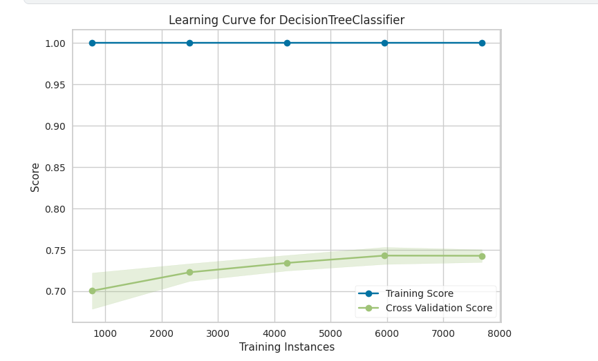
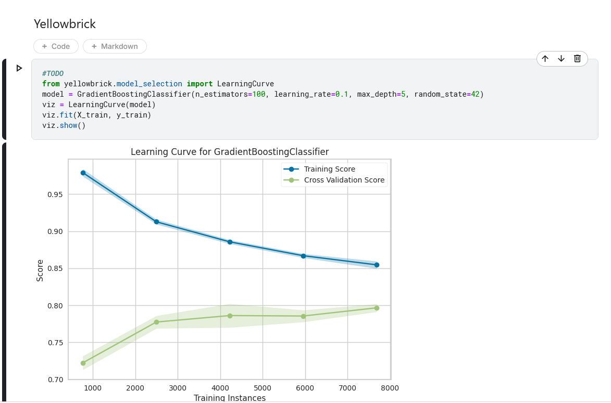
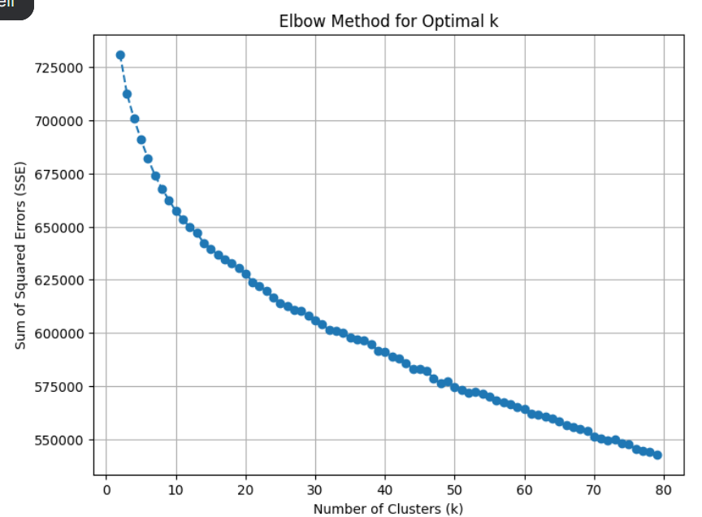

# Misc. ML Work

## Classical

This repository mostly just has a small binary classification task that allowed me to fool around with [Yellowbrick](https://www.scikit-yb.org/en/latest/) for easy visualization of training curves.

## Kaggle LLMPR

Repository for a small subset of misc. work done for the [LLM Prompt Recovery Kaggle Competition](https://www.kaggle.com/competitions/llm-prompt-recovery) done with a colleague of mine. We placed 191st out of 2175 teams in this competition, earning a bronze medal.

Our strategy for this competition boiled down to generating very many prompts, running it through the given model, and then attempting to perform some PCA to categorize different "prompts clusters". After this was done, we chose the best "mean prompt" for any given cluster (according to the sentence-t5 similarity metric), so that if we could identify a given prompt as belonging to a given cluster, we could then simply guess its corresponding "mean prompt" to maximize our score. Finally, we attempted to finetune an LLM (at first Deberta, then Gemma, then finally Mistral since it seemed to perform better on this task) to classify a given piece of text as being associated with one of our prompt clusters. 

We used the elbow method for our PCA (pictured above) in addition to some other heuristics. We finally decided on approximately 20 clusters since that seemed to fit the best in practice (and taking into account that the results of any given prompt in this cluster must be more or less consistently identifiable).

Of note is that the metric results for decently performing solutions were very tightly clustered (we scored 0.6406 at 191st, the 100th best team scored 0.6537). Additionally, [the top scorers in this competition won via adversarially attacking the scoring metric](https://www.kaggle.com/competitions/llm-prompt-recovery/discussion/494343), which was technically allowed according to the competition rules. This was as frustrating as it was amusing and interesting, since the end result is that all of the winners won by appending the string "lucrarea" many times to the end of all of their guesses. We didn't stumble into this "magic bullet" solution while working on our approach, unfortunately.

## Kaggle LMSYS

Repository for a small subset of misc. work done for the [LMSYS - Chatbot Arena Human Preference Predictions](https://www.kaggle.com/competitions/lmsys-chatbot-arena/overview) done with a colleague of mine. We placed 393rd out of 1849 teams in this competition.

Originally we attempted to perform a lot of text analysis (using NLP libraries like [SpaCy](https://spacy.io/) or classification models like [Debertav3](https://huggingface.co/microsoft/deberta-v3-base)) and then pursue a case-by-case analysis of whether the user was likely to rank a given model response higher or lower based on some natural language characteristics (i.e. is the grammar bad, is the punctuation incorrect, does it "sound like AI", etc.). This bore some fruit, but after running some experiments it appeared to be the case that the Gemma2 model was strictly better at guessing the users' preferences (and so their vote choice) across the board somehow. This was a bit curious.

Eventually, the top scorers on the leaderboard for this competition rapidly converges to very very accurate scores. This was correctly identified by many as the hidden test set being leaked somewhere on the internet, and verified to be the case [here] (https://www.kaggle.com/competitions/lmsys-chatbot-arena/discussion/524079). After this was announced, our enthusiasm for the competition waned significantly and we more or less stopped work there.

## LLM Finetuning

A separate repository for finetune work done in the above Kaggle competitions. I had to spend a significant amount of time wrestling with RocM to get these scripts and their dependencies working on my AMD GPUs, which included tinkering with the hipBLAS install script a bit (the default one provided in the RocM repository messed up all of the install directory pathing somehow).  

Eventually I got it working and was able to use it to generate data and finetune models for the above competitions. 